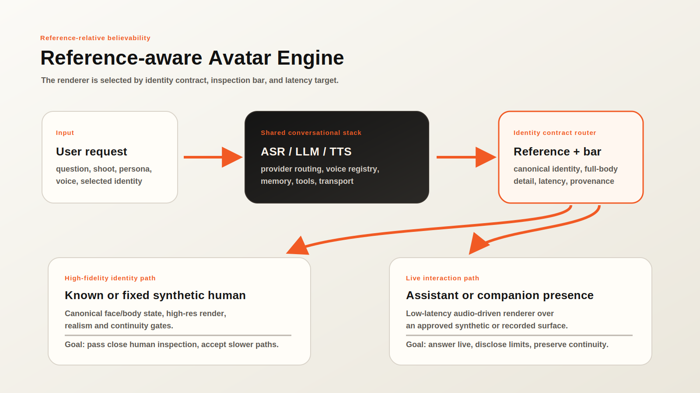

# Reference-relative believability in photoreal human avatars: synthetic identity as a systems constraint

*Anonymous submission — double-blind review copy. v0.3.*
*Intended classification: Human-computer interaction; computer graphics; computer vision; applied AI systems. Keywords: photoreal avatars, synthetic human identity, full-body generation, conversational agents, talking-head synthesis, uncanny valley, familiar face perception, identity, system design.*

## Abstract

Photoreal avatars are usually treated as renderer problems: make the generated human sharp enough, stable enough, and temporally coherent enough to pass as video. That account is incomplete. Avatar quality is judged relative to the reference implied by the product. For a known real person, the reference is the viewer's stored model of that person's appearance and motion. For a persistent synthetic character, the reference is the system's canonical identity state: face, body, voice, styling range, provenance, and continuity contract. For a one-off synthetic stranger, the reference is the broader human category. I define this dependency as reference-relative believability and use ground-truth drift for deviation from the applicable reference. The distinction yields testable predictions: familiarity-dependent rejection for known real people, continuity-dependent rejection for persistent synthetic identities, full-body exposure effects, and latency-fidelity tradeoffs between live interaction and close inspection. It also changes system design. The split is not known person versus invented person. It is high-fidelity identity path versus live interaction path. A prototype avatar engine implements this boundary with character registries, renderer routing, a local real-time talking-head loop, and separate high-fidelity identity-planning work for synthetic human rosters. The implementation is not perceptual validation, but it shows that the boundary is concrete enough to build.

## 1. Introduction

Photoreal avatar systems now combine several capabilities that are often discussed separately: image generation, full-body rendering, talking-head animation, speech recognition, language models, speech synthesis, memory, and browser or device transport. The product promise is larger than a face that talks. A mature avatar engine should support assistants, support agents, virtual friends, presenters, content creation, and persistent virtual talent for modeling or campaign work.

That product promise exposes a constraint that renderer-centric accounts miss. Most valuable avatars are not intended to copy one real person. They are authored synthetic identities. The target is still strict: a made-up character should be indistinguishable from a real human when that is the product claim, and it should remain the same character across sessions, poses, outfits, lighting, camera positions, and future model upgrades. The absence of a real-person original does not remove the reference problem. It moves the reference into the system.

The build history that motivated this manuscript began with a reusable avatar engine: character + voice + model + persona as a live interface. Early iterations treated known-person likenesses, support agents, assistants, presenters, and full-body synthetic characters as variants of the same rendering problem. That abstraction failed. Digital-double reconstruction, blendshape bridges, procedural idle motion, single-image reenactment, and mouth-only lip-sync failed in different ways. Later full-body experiments widened the failure surface: skin texture, eye highlights, hands, hair, face pixel size, body proportions, garment interaction, pose, and lighting became as important as lips or teeth.

I use reference-relative believability for the resulting principle. Avatar outputs are judged against the reference implied by the task. A known real person is judged against the viewer's stored model. A persistent synthetic character is judged against its canonical identity state. A one-off synthetic stranger is judged against the real-human category. Ground-truth drift is deviation from whichever reference applies.

This distinction changes the architecture. The practical split is not real person versus invented person. It is high-fidelity identity path versus live interaction path. The former is for artifacts expected to survive high-definition, close human inspection. The latter is for conversational presence, where latency and turn-taking are part of quality. Known-person likeness is one strict case inside the high-fidelity path, not the whole problem.

The claims are limited and testable:

1. It defines reference-relative believability and ground-truth drift for photoreal human avatars, including persistent synthetic identities.
2. It predicts familiarity, continuity, and full-body exposure effects that a renderer-only account does not predict.
3. It derives an identity-contract architecture that separates high-fidelity identity rendering from live interaction while preserving a shared conversational stack.

## 2. Background and related work

### 2.1 Uncanny valley and cue inconsistency

Mori's uncanny valley gives the familiar shape of the problem: affinity drops when an entity becomes nearly, but not fully, human [1]. Later accounts sharpen the mechanism by emphasizing motion, category conflict, and prediction error [2, 3]. Those accounts explain why a stimulus can feel wrong. They do not, by themselves, explain why the same renderer can be tolerable in one product context and intolerable in another. The missing variable is not only in the pixels. It is the reference the output is expected to satisfy. Recent avatar studies are consistent with this: controlled experiments show that perceived naturalness and eeriness depend on the consistency of realism cues and on the interaction context rather than on raw fidelity alone [14], and a network meta-analysis of avatar-realism studies finds that the effect of appearance realism on perceptual experience is moderated by task and setting [15].

### 2.2 Familiar and self-face perception

Familiar-face research supplies the known-person asymmetry. Familiar faces are processed differently from unfamiliar faces [4, 5], and people recognize them under degraded conditions that defeat unfamiliar-face recognition [6, 7]. Self-face processing is also special [8]. In recognition tasks, this robustness is an advantage. In synthesis, it can become a liability. The same stored model that lets a viewer recognize a poor recording of a familiar person also gives them a sharper target for rejecting an almost-correct reconstruction. Recent synthetic-media work supplies converging evidence: a systematic review of human deepfake detection finds that familiarity with the depicted person improves detection of manipulated faces, moderated by generation quality and by whether the depicted behavior is plausible for that person [16]. The known-person asymmetry this manuscript predicts is therefore not hypothetical; it already appears in detection studies as a familiarity advantage that a synthesis system must overcome.

### 2.3 Talking-head and portrait animation systems

Talking-head systems generate or retarget facial motion from speech, images, video, or learned motion spaces [9-12]. Newer unified audio-to-video systems suggest that live avatar quality will keep improving [13]. The point here is not that these systems are weak. The point is that many systems optimize a narrow face crop or a short video window, while product-grade avatars may require full-body identity, garment realism, continuity across shoots, and close inspection. Small losses in skin texture, mouth detail, hand anatomy, head motion, gaze, or temporal consistency have different costs depending on the reference contract.

### 2.4 Synthetic identity, provenance, and presence

Three further literatures bear on the reference argument. First, the deepfake and face-swap literature is, in effect, the study of identity judged against an external reference; its central finding — that viewers detect manipulation better when the identity is familiar [16] — is the known-person case of reference-relative believability stated in detection terms. Second, content-provenance efforts such as the C2PA Content Credentials specification attach cryptographically signed origin and edit history to media [17]. Provenance is orthogonal to perceptual realism, but it is the mechanism by which a system can bind an output to a declared reference and continuity contract, which is exactly what the architecture in Section 6 enforces at the renderer boundary. Third, work on avatar realism and social presence shows that acceptance depends on immersion, task, and interaction context, not fidelity in isolation [14, 15], which is why this manuscript separates a close-inspection realism bar from a live-presence bar rather than collapsing both into one "photoreal" score.

## 3. Definitions

Five terms carry the argument.

**Reference.** A reference is the target against which the avatar is judged. It may be external viewer memory of a real person, an internal canonical identity state for a synthetic character, or the broader category of real human appearance and motion.

**Known-person reference.** A known-person reference exists when the product claim requires acceptance as a known real human. Examples include a user's own likeness, a company's real spokesperson, or a public figure. Deviations from the stored reference are identity errors, not merely artifacts.

**Canonical synthetic identity.** A canonical synthetic identity is an authored character with durable system state: face, body, voice, styling range, identity references, provenance, policy, and continuity thresholds. It is not copied from one real person, but it still has a reference once saved and reused.

**One-off synthetic stranger.** A one-off synthetic stranger is an invented human image or clip with no durable identity contract. It must still satisfy the real-human category bar, but it is not yet responsible for continuity across future uses.

**Ground-truth drift.** Ground-truth drift is deviation from the applicable reference. For a known person, drift is mismatch with viewer memory. For a canonical synthetic identity, drift is mismatch with the stored identity contract. For a one-off stranger, drift is failure to belong convincingly to the real-human category.

**Reference-relative believability.** Reference-relative believability is the claim that perceived avatar quality is a function of generated output quality, reference strength, task context, and inspection level. In simplified form:

> perceived believability = f(render quality, reference strength, task context, inspection level)

This expression is schematic, not a fitted model. It names the factors the account holds responsible; their operational measures and the statistical model that relates them are given in Section 5.2 and 5.3. The contribution is the set of factors and their predicted interactions, not a specific functional form.

The claim does not imply that synthetic identities are automatically believable. They can fail through ordinary artifacts: unstable geometry, dead eyes, poor lip sync, incoherent lighting, waxy skin, broken hands, body inconsistency, or temporal jitter. The claim is narrower: different references create different error budgets.

## 4. Hypotheses

If the account is right, user ratings move in specific ways.

**H1: familiarity gradient.** For the same synthesis pipeline and artifact level, naturalness ratings will decrease as viewer familiarity with a depicted real person increases.

**H2: self-recognition ceiling.** Self-avatar clips will be rejected at fidelity levels that the same viewers accept for unfamiliar humans or newly authored synthetic identities.

**H3: synthetic rescue with decay.** A synthesis pipeline judged unacceptable for a known person's likeness will receive higher naturalness and acceptance ratings when the identity is replaced with a newly authored synthetic identity, holding rendering method, framing, prompt content, and voice quality as constant as possible. The advantage should shrink after the synthetic identity is made persistent and repeatedly shown to raters.

**H4: continuity-contract penalty.** Persistent synthetic identities will be rejected more often than one-off synthetic strangers when outputs drift from a canonical reference set, even if independent raters score the visible artifacts similarly.

**H5: full-body exposure effect, with a reference interaction.** Moving from headshot or bust framing to full-body framing will increase rejection because it exposes hands, hair, body proportions, garment interaction, face-pixel limits, pose, and lighting coherence. The non-obvious prediction is the interaction: the full-body penalty will be larger for persistent synthetic identities and known people than for one-off strangers, because the added surface must match a stored reference (a saved body state or viewer memory), not merely belong to the human category. A one-off stranger only has to look plausibly human at full body; a persistent identity has to look like the same body it established earlier.

**H6: latency-fidelity trade.** Live interaction paths will score better on perceived responsiveness and presence, while gated high-fidelity paths will score better on close-inspection realism and identity continuity.

These hypotheses can fail. If viewer familiarity does not affect naturalness or "not them" judgments after controlling for visible artifact severity, the known-person mechanism is wrong or incomplete. If persistent synthetic identities are not penalized for continuity drift, the canonical-reference mechanism is wrong or incomplete.

## 5. Evaluation protocol

A minimal study can use existing synthesis pipelines. The important move is to hold the renderer fixed and vary the identity relation between clip and rater.

### 5.1 Stimuli

The stimulus set needs four classes:

1. **Known-person clips.** Synthesized clips of subjects for whom a subset of raters has direct familiarity.
2. **Unfamiliar real-person clips.** Synthesized clips of real people unknown to the raters.
3. **New synthetic-identity clips.** Synthesized clips of authored identities with no prior exposure to raters.
4. **Persistent synthetic-identity clips.** Synthesized clips or images of authored identities after raters have been shown a canonical reference set.

Duration, framing, lighting, prompt content, voice quality, and output resolution are held constant where possible. The study should include both headshot and full-body conditions. If known-person voice cloning is used, voice familiarity must be modeled separately because voice carries its own reference.

### 5.2 Measures

Each rater supplies:

1. Naturalness rating.
2. Identity acceptance rating for known-person and persistent synthetic clips.
3. "Not quite them" judgment for known-person clips and "not the same character" judgment for persistent synthetic clips.
4. Comfort or uncanny-valley rating.
5. Free-text artifact description.
6. Familiarity rating for the depicted identity or exposure count for synthetic identities.
7. Confidence in judgment.

Artifact severity is rated by a separate group that does not know the depicted identities. That separates visible defects from familiarity-driven rejection.

### 5.3 Analysis

The primary model treats acceptance as a function of identity condition, viewer familiarity or exposure, artifact severity, framing, inspection level, and their interactions. A mixed-effects model is the natural fit because both clips and raters repeat. The key tests are whether familiarity predicts lower acceptance for known-person clips after artifact severity is included, and whether canonical exposure predicts lower tolerance for continuity drift in persistent synthetic identities.

### 5.4 Expected result pattern

The reference-relative account predicts the following ordering, from easiest to hardest, assuming comparable artifact severity:

1. One-off synthetic stranger.
2. Unfamiliar real person.
3. Newly authored synthetic identity.
4. Persistent synthetic identity with a canonical reference set.
5. Weakly familiar public figure.
6. Personally familiar person.
7. Self-avatar.

This ordering is not a moral or legal ranking. It is a perceptual error-budget ranking. Safety, consent, provenance, and labeling requirements may be strict in every tier.

## 6. System architecture

In an implementation, the claim becomes a router. The conversational stack can be shared, but the render path is selected by identity contract, inspection bar, latency target, and provenance requirement.

*Figure 1. Reference-aware Avatar Engine architecture. The conversational stack is shared, but the renderer is selected by identity contract, inspection bar, latency target, and provenance requirement.*

The shared stack includes speech recognition, language model, tools, memory, voice selection, transport, and policy controls. None of these components necessarily changes the identity surface. The identity contract router is the boundary where visual identity becomes a systems constraint.

High-fidelity identity requests route to a gated render path. For known people, that may mean recorded footage, constrained playback, or narrow edits that preserve the recorded identity surface. For canonical synthetic identities, it means high-resolution generation, full-body realism gates, continuity checks, provenance, and human review for uncertain cases. This path may sacrifice latency to protect identity and close-inspection realism.

Live interaction requests route to a low-latency path: talking-head renderers, audio-driven animation, pre-rendered idle clips, or streaming video chunks. This path optimizes responsiveness and presence while preserving the character registry and policy contract. It should not be represented as proof of full-body indistinguishability unless it clears that separate gate.

Registry design changes too: a character carries identity provenance, canonical state, allowed renderers, voice policy, continuity thresholds, disclosure rules, and safety constraints. This prevents a high-fidelity identity from entering an inappropriate renderer and prevents a low-latency surface from making claims it cannot satisfy.

Figure 1 draws the shared stack as a cascade of speech recognition, language model, and speech synthesis, but the argument does not depend on that decomposition. Emerging end-to-end systems collapse the cascade into a single model that jointly perceives and generates synchronized audio and video at sub-second latency [13]. Such a system replaces the low-latency render path, not the identity contract. Reference-relative believability is a claim about the relation between an output and the reference a viewer or system holds; it is indifferent to whether that output is produced by a cascade or by one unified model. A unified model still needs to be told which identity it may present, whether the result must clear a full-body close-inspection gate, and which provenance and continuity rules apply. The router therefore sits above the renderer regardless of the renderer's internal architecture, and a more capable live renderer raises the live-presence score without, by itself, discharging the separate high-fidelity identity bar.

## 7. Implementation feasibility

A prototype avatar engine implements the split. This section is a feasibility argument, not perceptual validation and not an independently verifiable benchmark: it shows that the identity boundary can be expressed as concrete data contracts and enforced in code, which is what distinguishes an architectural claim from a slide label. Because the prototype is not yet public, the details below should be read as an existence argument that the boundary is buildable, not as a measured result. The relevant details are concrete:

1. The Python package defines character, voice, language-model, and renderer registries.
2. Character records carry tier and visibility constraints.
3. Renderers sit behind a fixed `RenderEngine` provider protocol.
4. A Ditto-backed provider drives the low-latency talking-head path.
5. A local conversational loop connects speech recognition, an Ollama language model, Piper voice synthesis, and the renderer.
6. TensorRT acceleration on the Ditto path reaches the real-time interaction tier on local GPU hardware.
7. A resident worker keeps the renderer warm, and a streaming path renders answer chunks as they complete.
8. Separate high-fidelity planning work defines synthetic identity creation, roster state, full-body variation grids, realism gates, continuity services, provenance records, and human review.

The prototype does not close the product. Full-duplex barge-in, idle motion, latency tuning, full-body video, garment transfer, and large-scale perceptual validation remain open engineering work. The important point is narrower: the identity split is not a slide label. It is represented in data contracts and enforced at the registry and renderer boundary.

## 8. Design implications

The identity-contract split changes the product specification. "Photoreal" is not enough. A requirement has to state which reference the avatar must satisfy: known-person memory, canonical synthetic identity, or one-off human realism.

It also changes benchmarks. Category-level realism, canonical identity continuity, known-person likeness, full-body close-inspection realism, and conversational presence belong in separate scores. A renderer can be good enough for a live assistant and still unacceptable for a full-body virtual model. Conversely, a slower gated render path can be correct for high-fidelity identity work even if it gives up real-time interaction.

Identity provenance belongs in the render contract. The renderer needs to know whether it is allowed to synthesize the identity surface, whether the output must pass full-body gates, whether the character is persistent, and which disclosure requirements apply. This is not a user-interface detail; it is part of the safety boundary.

## 9. Safety and ethics

Reference-relative believability is not an argument for easier deployment of synthetic people. Synthetic humans can manipulate, mislead, create false impressions of agency, or be misused even when they do not copy one real person. Known-person likeness raises additional consent and impersonation concerns because it invokes an external real identity.

The identity distinction belongs in the system, not in copy or policy language alone. Known-person identities require provenance, consent, disclosure, and renderer constraints. Signed content-provenance standards such as C2PA Content Credentials [17] give a concrete transport for the provenance and disclosure fields the identity contract carries, though they do not by themselves prevent misuse and can be stripped in re-encoding. Persistent synthetic identities still need labeling, source-safety rules, similarity checks, age safeguards, continuity records, and audit logs, especially in support, sales, education, medical, modeling, or companion contexts.

The architecture also reduces accidental misuse. If identity contracts constrain renderer access, a product is less likely to convert a real person's likeness into an unconstrained speaking agent or let a persistent synthetic identity drift through configuration changes.

## 10. Limitations

This manuscript does not report a completed human-subjects study. Its contribution is a framework, a set of falsifiable predictions, and a pre-registration-ready evaluation protocol (Section 5), not an empirical result; it should be read and judged as such. The hypotheses are testable, but the empirical curve remains open. The proposed gradients may vary by culture, task, screen size, exposure duration, artifact type, and inspection condition.

The distinction between one-off and persistent synthetic identities can also blur. A synthetic character used for a long time may become familiar to users, creating a new viewer-side reference. A public synthetic character may acquire a stable identity that future renderers must preserve. The tier model should therefore be treated as a starting condition and governance rule, not a permanent guarantee.

Future renderers may reduce visible drift enough that the thresholds move. The claim does not depend on today's artifacts being permanent. It depends on the comparison relation between output and viewer. If that relation stops predicting acceptance, the theory has to change.

## 11. Conclusion

Photoreal avatars are not one fidelity problem. A one-off synthetic stranger must look like a real human. A persistent synthetic identity must also remain the same character across contexts. A known-person likeness must remain correct relative to viewer memory. A live assistant must answer quickly enough to feel present. These requirements impose different error budgets and should not be routed through one undifferentiated renderer. Reference-relative believability explains why the practical architecture should split high-fidelity identity work from live interaction. That design does not solve every avatar problem, but it avoids forcing one system to satisfy incompatible perceptual contracts.

## References

[1] M. Mori, "The uncanny valley," *Energy*, vol. 7, no. 4, pp. 33-35, 1970. Trans. K. F. MacDorman and N. Kageki, *IEEE Robotics & Automation Magazine*, vol. 19, no. 2, pp. 98-100, 2012.

[2] A. P. Saygin, T. Chaminade, H. Ishiguro, J. Driver, and C. Frith, "The thing that should not be: predictive coding and the uncanny valley in perceiving human and humanoid robot actions," *Social Cognitive and Affective Neuroscience*, vol. 7, no. 4, pp. 413-422, 2012.

[3] R. K. Moore, "A Bayesian explanation of the 'uncanny valley' effect and related psychological phenomena," *Scientific Reports*, vol. 2, art. 864, 2012.

[4] V. Bruce and A. Young, "Understanding face recognition," *British Journal of Psychology*, vol. 77, no. 3, pp. 305-327, 1986.

[5] R. A. Johnston and A. J. Edmonds, "Familiar and unfamiliar face recognition: a review," *Memory*, vol. 17, no. 5, pp. 577-596, 2009.

[6] A. M. Burton, S. Wilson, M. Cowan, and V. Bruce, "Face recognition in poor-quality video: evidence from security surveillance," *Psychological Science*, vol. 10, no. 3, pp. 243-248, 1999.

[7] P. J. B. Hancock, V. Bruce, and A. M. Burton, "Recognition of unfamiliar faces," *Trends in Cognitive Sciences*, vol. 4, no. 9, pp. 330-337, 2000.

[8] F. Tong and K. Nakayama, "Robust representations for faces: evidence from visual search," *Journal of Experimental Psychology: Human Perception and Performance*, vol. 25, no. 4, pp. 1016-1035, 1999.

[9] K. R. Prajwal, R. Mukhopadhyay, V. P. Namboodiri, and C. V. Jawahar, "A lip sync expert is all you need for speech to lip generation in the wild" (Wav2Lip), in *Proc. ACM Int. Conf. Multimedia (MM)*, 2020, pp. 484-492.

[10] J. Guo et al., "LivePortrait: efficient portrait animation with stitching and retargeting control," arXiv:2407.03168, 2024.

[11] T. Li, R. Zheng, M. Yang, J. Chen, and M. Yang, "Ditto: motion-space diffusion for controllable realtime talking head synthesis," arXiv:2411.19509, 2024 (ACM MM 2025).

[12] S. Xu et al., "VASA-1: lifelike audio-driven talking faces generated in real time," in *Advances in Neural Information Processing Systems (NeurIPS)*, 2024. arXiv:2404.10667.

[13] Wan Team, Alibaba Group, "Wan-Streamer v0.1: end-to-end real-time interactive foundation models," arXiv:2606.25041, 2026.

[14] T. D. Do, R. P. McMahan, and P. J. Wisniewski, "A new uncanny valley? The effects of speech fidelity and human listener gender on social perceptions of a virtual-human speaker," in *Proc. CHI Conf. Human Factors in Computing Systems (CHI '22)*, 2022.

[15] Z. Tao, Y. Liu, J. Qiu, and S. Li, "Impact of virtual avatar appearance realism on perceptual interaction experience: a network meta-analysis," *Frontiers in Psychology*, vol. 16, art. 1624975, 2025.

[16] K. Somoray, D. Miller, and M. Holmes, "Human performance in deepfake detection: a systematic review," *Human Behavior and Emerging Technologies*, 2025, doi:10.1155/hbe2/1833228.

[17] Coalition for Content Provenance and Authenticity, "C2PA technical specification (Content Credentials)," version 2.2, 2025. [Online]. Available: https://c2pa.org/specifications/
